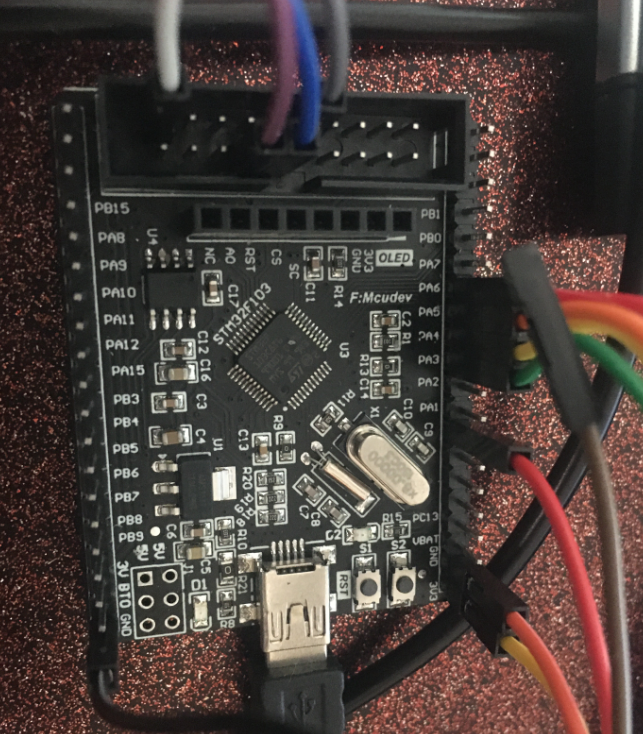
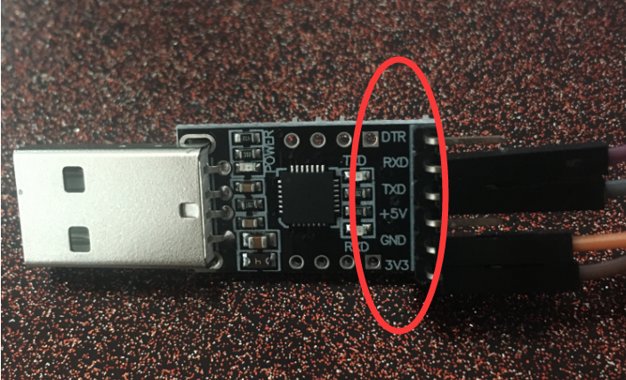
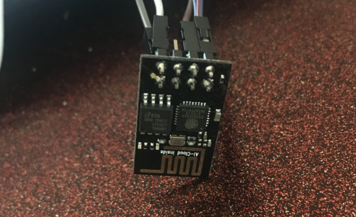
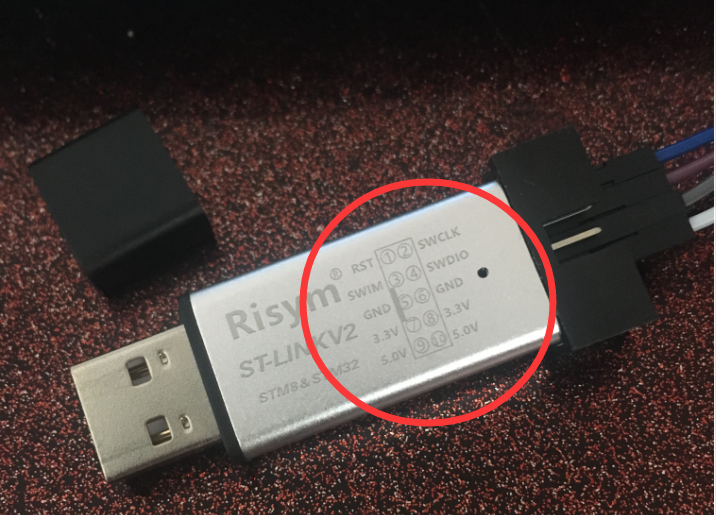
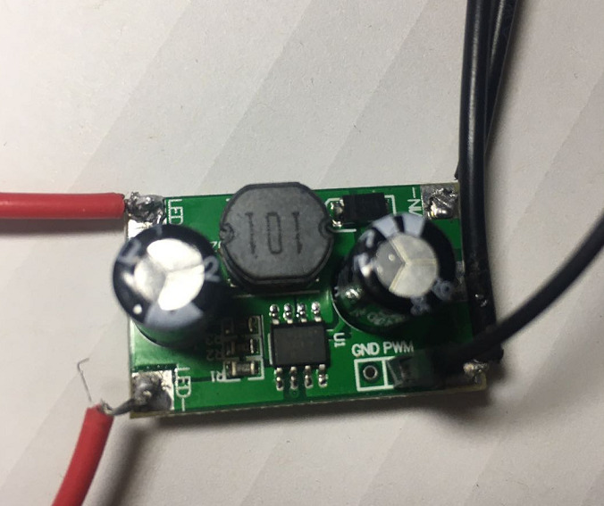
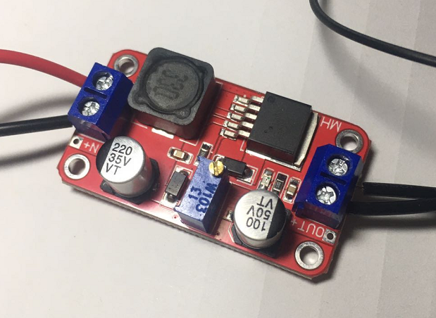
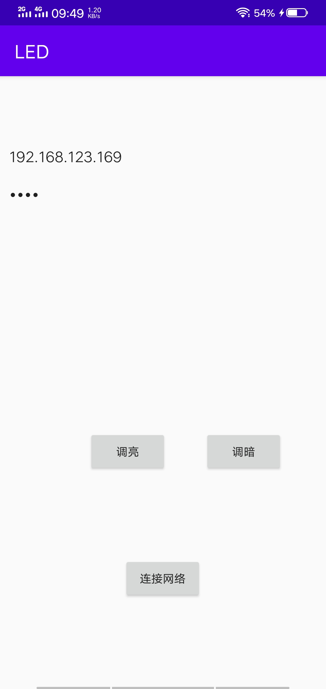
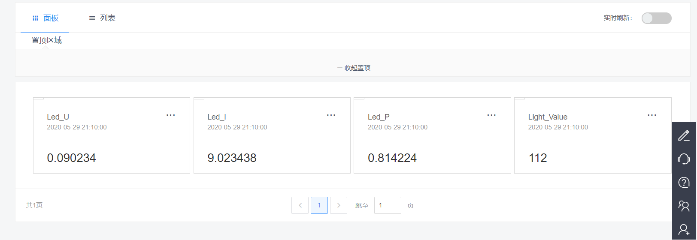

# Light_Control
基于STM32F103C8T6、ESP8266WiFI、Onenet云端、安卓APP的智能灯光控制系统

---

### 目录解说：
```
androidContorl 是APP工程。
stm32Project 是32单片机的工程，包括初始化ESP8266连接和接收模式。
```
### 硬件设备
1、单片机采用STM32F103C8T6型号控制器


2、串口调试设备


3、esp8266 WIFI模块


4、下载模块


5、LED灯驱动模块


6、LED灯电源模块


### APP
APP采用Android Studio 进行开发<br>
连接需要输入ESP8266的IP地址和端口号（ESP8266的AT指令可配置，详见工程代码）


### OneNET云端
云端采用OneNET开放平台，采用EDP方式与ESP8266进行通信<br>
这种模式，需要ESP8266进行联网操作，可以连接wifi热点（工程代码可配置wifi热点信息）


---

## 项目总结
系统目前实现功能：
```
1、单片机按键切换模式：按键控制灯光、根据光照强度自动控制灯光、灯光数据上传云平台、安卓APP控制灯光。
2、每个模式之间相互独立。
```

说明：
```
使用本系统，在进入灯光数据上传云平台模式下，需要给ESP8266设置热点进行联网（此时ESP8266相当于客户端），热点的相关信息可在程序代码中配置；在安卓APP控制模式下，需要让APP所在的设备接上ESP8266的热点（此时ESP8266相当于服务器），再打开APP进行IP地址的直接相连进行通信。
```